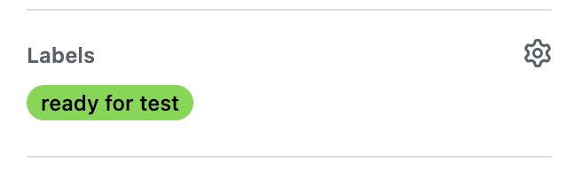
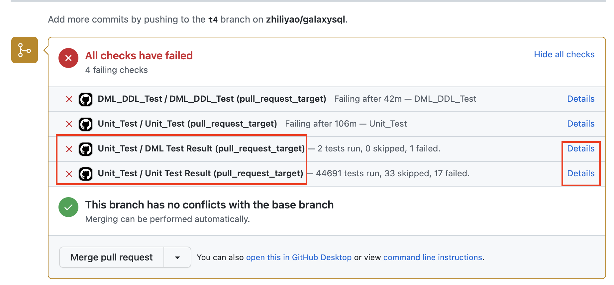
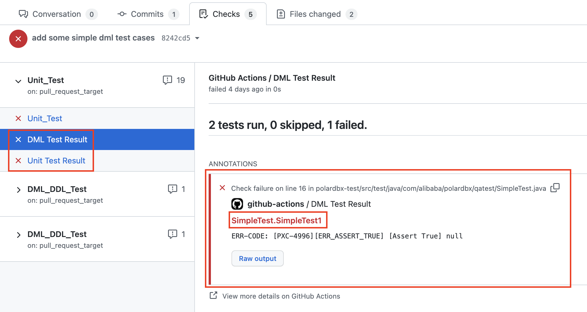

# How to check test cases in your PR

When contributing codes and adding new features for PolarDB-X, you should also include corresponding test cases in your PR. You should make sure all test cases, including the existing ones, are passed. 

You can follow the instructions below to achieve this.

When you create a new PR, ask some reviewer to add a *read-for-test* tag for the PR.

Check the test reports after all tests are completed. Click *Details* of XX Test Result to see detailed reports.

Your should see the details of all **FAILED** test cases.

Finally, update your codes according to the failed test cases.
